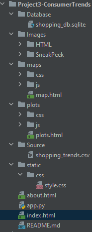
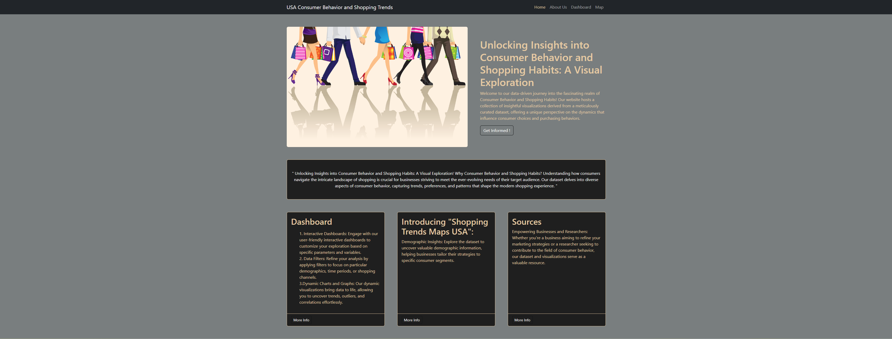
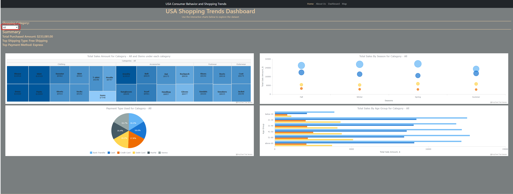
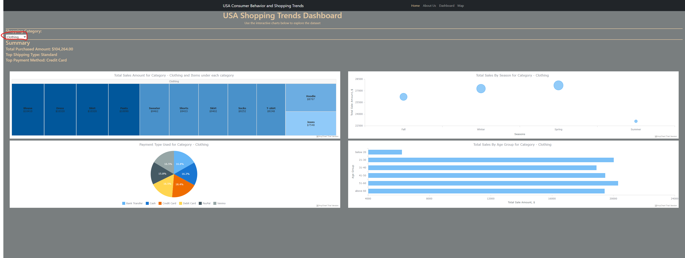
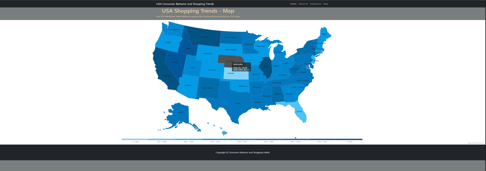

# Project3-data-visualization - USA Consumer Behavior and Shopping Trends

### Contributor
[Nidhi Mishra Ojha](https://www.linkedin.com/in/nidhimishraojha/)

### Website 
[USA Consumer Behavior and Shopping Trends](https://nidhi0684.github.io/project3-usa-consumer-and-shoppng-trends/index.html)

### Project Purpose and Overview
The Consumer Behavior and Shopping trends website helps to provide insightful and visually compelling representations of consumer behavior and shopping trends across the four shopping categories within the United States. By leveraging data visualization techniques, the project seeks to explain key insights from a complex dataset into easy to understand visual representation, fostering a deeper understanding of consumer preferences, purchase patterns, and market trends.

#### Overview
The USA Consumer Behavior and Shopping Trends Data Visualization project aims to unravel profound insights into consumer behavior and shopping trends across diverse sectors in the United States. The project utilizes a Kaggle dataset, providing a comprehensive snapshot of E-Commerce Transaction Trends. Data cleaning processes ensure data accuracy and consistency, forming the bedrock for transparent and insightful visualizations.

#### Key Components
1. #### Data Sourcing and Preparation:
    Leveraging a Kaggle dataset, we meticulously curate a rich repository of E-Commerce Transaction Trends. The data undergoes thorough cleaning to eliminate discrepancies, ensuring a reliable foundation for subsequent visualization endeavors.

2. #### Advanced Visualization Techniques:
    Employing data visualization tools, our project transforms intricate datasets into a visually intuitive format. Dynamic charts, graphs, heatmaps, and interactive dashboards serve as powerful tools to illustrate trends, correlations, and anomalies within consumer behavior.

3. #### Interactive Dashboard Features:
    The website's dashboard offers users an immersive experience with interactive visualizations. A dropdown menu enables users to explore metadata for specific shopping categories, unveiling insights such as Total Purchased Amount, Top Shipping Type, and Top Payment Method. Four distinct graph types—treemap, bubble chart, pie chart, and horizontal bar graphs—provide comprehensive insights into trends across shopping categories.

4. #### Geospatial Insights:
    The map tab on the website unveils a heatmap showcasing the total purchase amount in dollars across all U.S. states across all shopping categories. This geographical perspective enhances understanding by visualizing regional variations in consumer spending patterns.

5. #### User-Friendly Navigation:
    All pages are seamlessly linked to the homepage, ensuring a cohesive and user-friendly experience. The website structure facilitates a thorough understanding of consumer behavior across the U.S., focusing on four identified shopping categories derived from the dataset.

#### In Conclusion:
This data visualization project strives to empower businesses, policymakers, and researchers with actionable insights derived from a comprehensive analysis of USA consumer behavior and shopping trends. By combining sophisticated visualization techniques with user-friendly features, the platform enables stakeholders to make informed decisions and navigate the dynamic landscape of the American marketplace.

### How to interact with website?
#### 1. Project Organization

- Dataset from Kaggle in CSV format is located under /Source folder
- Sanitized dataset is persisted into SQLite DB stored in "shopping_db.sqlite" located under /Database folder
- Python code using SQLAlchemy to fetch data from SQLite and Flask to serve request from Website for data is in "app.py"
- Data Visualization Website compose of following 
    - index.html for Home Page
    - about.html for About Us
    - ./static/css/ contains CSS stylesheet for above two pages
    - ./plot folder contains HTML page, stylesheet, and supporting javascript for Visualization Dashboard
    - ./maps folder contains HTML page, stylesheet, and and supporting javascript for displaying shopping trends on USA Map
#### 2. Pre-requisities
- For successful run of app.py (Flask app), following python libraries are required
    - flask
    - flask_cors
    - sqlalchemy
    - locale
- For DataVisulatization Website, please ensure **app.py is running** which will ensure API endpoints are available for website to return requested data
- To run app.py, run "python app.py" on command prompt
- Successful run of app.py will start Flask app with following message
    - Running on http://127.0.0.1:< port number >
- Visit the URL from above message, and it should list all the available routs supported by this Flask app.
- **NOTE - Successful run of Flask App is required to launch Visulization Website**

#### 3. Website
- After successful run of Flass App, launch this [website](https://nidhi0684.github.io/project3-usa-consumer-and-shoppng-trends/index.html)
- Home Page - Landing page with links to Dashboard, Map View, About, and links to Dataset used for this project
- About Me - Brief bio about the developer (Nidhi Ojha)
- Dashboard - 4 visualizations showing consumer trends with dynamic views for consolidated and each shopping category
- Map - Total Sales done by each USA state across all shopping category.

### Ethical considerations
1. #### Privacy Protection:
    The project places a paramount emphasis on safeguarding user privacy. Data sourced from the Kaggle dataset is anonymized, ensuring that individual consumer information is protected. Personal identifiers are removed to comply with data protection regulations, mitigating the risk of unauthorized access or misuse.

2. #### Transparency in Data Sourcing:
    Transparent communication is maintained regarding the origin and nature of the dataset used. Clear documentation accompanies the project, providing users with insights into the dataset's source, limitations, and any potential biases. This transparency fosters trust among users and stakeholders.

3. #### Inclusive Representation:
    Efforts are made to ensure inclusive representation in data visualization. The project is designed to avoid perpetuating stereotypes or biases related to age, gender, ethnicity, or other demographic factors. Visualizations are crafted to accurately reflect the diversity of consumer behavior without reinforcing societal prejudices.

4. #### User Consent:
    Prioritizing user consent, the project includes interactive features that allow users to engage with the data voluntarily. 

5. #### Responsible Data Handling:
    The team adheres to ethical standards in data handling, avoiding the manipulation or misrepresentation of data. The cleaning process focuses on maintaining accuracy without introducing bias. The project aims to present an honest and accurate portrayal of consumer behavior trends.

6. #### Accessible Design:
    The website is designed with accessibility in mind, ensuring that individuals with diverse abilities can engage with the visualizations. This commitment to inclusivity extends to the choice of colors, contrast, and overall design, ensuring that the platform is accessible to a wide range of users.

7. #### Security Measures:
    Security measures are implemented to protect against potential breaches or unauthorized access to sensitive data. Encryption protocols and secure hosting practices are employed to safeguard the integrity of the data and maintain user trust.

By incorporating these ethical considerations, the USA Consumer Behavior and Shopping Trends Data Visualization Project seeks to not only provide valuable insights but also to uphold the principles of privacy, transparency, and inclusivity in the realm of data analysis and visualization.

### Sneak Peek 
***Home***

***Interactive Dashboard - All Categories***

***Interactive Dashboard - Clothing Category***

***USA Map - Total Sales per USA State***

### Data Source
[Kaggle: Consumer Behaviour and Shopping Habits Dataset](https://www.kaggle.com/datasets/zeesolver/consumer-behavior-and-shopping-habits-dataset/)

### References

[D3js](https://d3js.org/) - API calls and JSON parsing

[AnyChart](https://www.anychart.com/) - Data Visualization

[Stackoverflow](https://stackoverflow.com/) - Technical help

#### PRESENTATION LINK: https://github.com/nidhi0684/project3-usa-consumer-and-shoppng-trends/blob/main/presentation/USA%20Consumer%20Behavior%20and%20Shopping%20Trends.pptx

